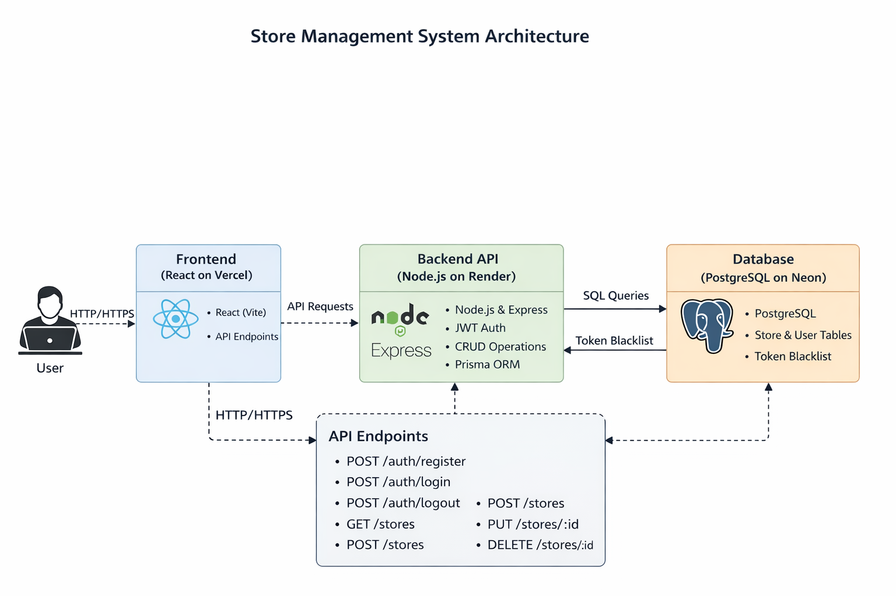
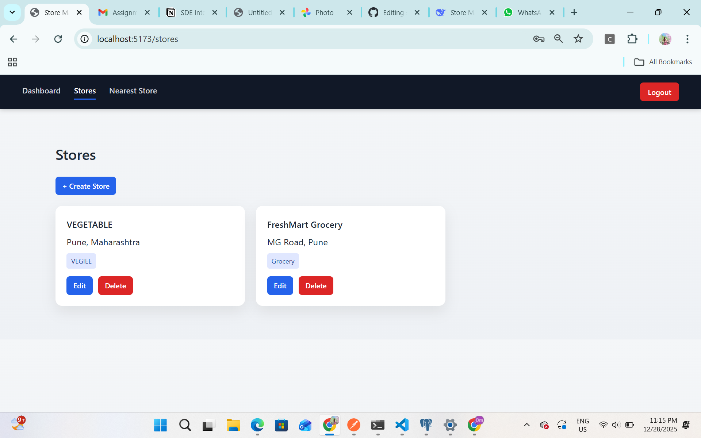
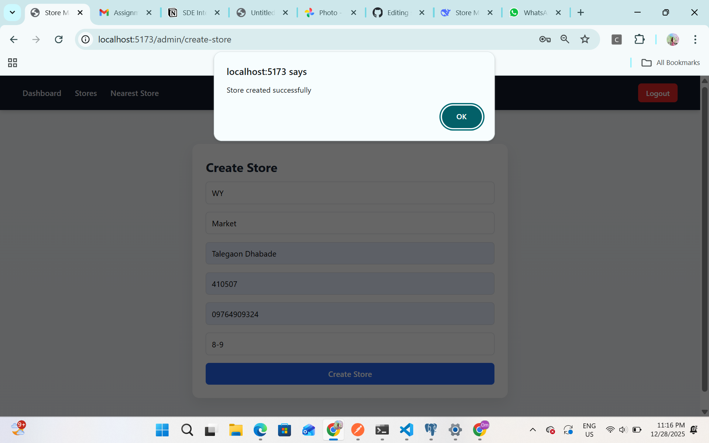
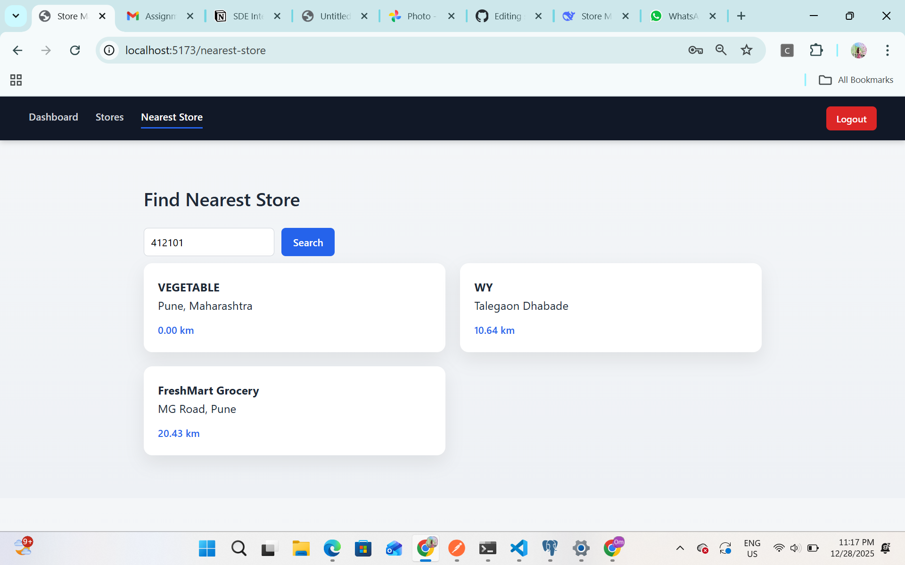
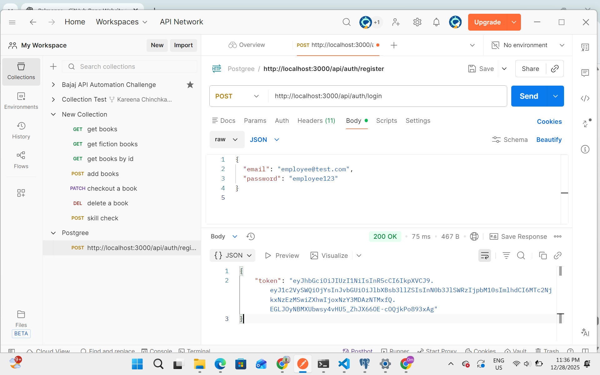

# 🏬 Store Management System

A Full-Stack Store Management System designed to manage stores, inventory, and operations efficiently using modern web technologies.

---

## Problem Statement

Businesses struggle with:
- Inefficient stock tracking  
- Stockouts and overstocking  
- Manual inventory errors  
- No real-time insights  
- Poor coordination between stores  
- Difficulty analyzing sales patterns  

Small and medium businesses need an **affordable, centralized, end-to-end inventory and store management solution**.

---

## Solution — Store Management System

An integrated platform that:
- Manages multiple stores centrally
- Tracks inventory in real time
- Provides actionable analytics
- Improves operational efficiency and decision-making

---

## Key Features

### Store Management
- Multi-store support
- Staff and role-based access
- Store-wise performance tracking

### Inventory Management
- Real-time stock monitoring
- Low-stock alerts
- Product tracking and categorization

### Analytics Dashboard
- Modern React-based UI
- Interactive charts
- Real-time insights

### Backend APIs
- RESTful architecture
- Secure authentication
- Scalable backend design

---

## 🛠️ Tech Stack

### Frontend
- **React.js** – Component-based UI development
- **Vite** – Fast build tool and development server
- **HTML5** – Semantic markup
- **CSS3** – Custom styling (no CSS frameworks used)
- **JavaScript (ES6+)** – Modern JavaScript features

### Backend
- **Node.js** – JavaScript runtime environment
- **Express.js** – RESTful API framework

### Database
- **PostgreSQL** – Relational database
- **Prisma ORM** – Type-safe database access and migrations

### Authentication & Authorization
- **JWT (JSON Web Tokens)** – Secure authentication
- **bcrypt** – Password hashing
- **Role-Based Access Control (RBAC)** – Admin, Manager, Employee

### APIs & Services
- **OpenStreetMap (Nominatim API)** – Pincode to latitude/longitude conversion
- **Haversine Formula** – Distance calculation for nearest store search

### Tools & Utilities
- **Git & GitHub** – Version control
- **Postman** – API testing and documentation
- **VS Code** – Development environment
- **Axios** – HTTP client for frontend API calls
- **Nodemon** – Backend auto-reload during development


---

## System Architecture



---

## Project Structure

```
store-management-system/
│
├── backend/
│   ├── prisma/
│   │   ├── schema.prisma
│   │   ├── migrations/
│   │   └── seed.js
│   │
│   ├── src/
│   │   ├── controllers/
│   │   │   ├── auth.controller.js
│   │   │   ├── store.controller.js
│   │   │   ├── user.controller.js
│   │   │   └── location.controller.js
│   │   │
│   │   ├── routes/
│   │   │   ├── auth.routes.js
│   │   │   ├── store.routes.js
│   │   │   ├── user.routes.js
│   │   │   └── location.routes.js
│   │   │
│   │   ├── middlewares/
│   │   │   ├── auth.middleware.js
│   │   │   ├── role.middleware.js
│   │   │   └── error.middleware.js
│   │   │
│   │   ├── services/
│   │   │   ├── jwt.service.js
│   │   │   ├── password.service.js
│   │   │   └── geo.service.js
│   │   │
│   │   ├── utils/
│   │   │   └── haversine.js
│   │   │
│   │   ├── app.js
│   │   └── server.js
│   │
│   ├── .env
│   ├── .env.example
│   ├── package.json
│   └── README.md
│
├── frontend/
│   ├── public/
│   │   └── index.html
│   │
│   ├── src/
│   │   ├── api/
│   │   │   └── api.js
│   │   │
│   │   ├── components/
│   │   │   ├── Navbar.jsx
│   │   │   └── ProtectedRoute.jsx
│   │   │
│   │   ├── context/
│   │   │   └── AuthContext.jsx
│   │   │
│   │   ├── pages/
│   │   │   ├── Login.jsx
│   │   │   ├── AdminDashboard.jsx
│   │   │   ├── ManagerDashboard.jsx
│   │   │   ├── EmployeeDashboard.jsx
│   │   │   ├── Stores.jsx
│   │   │   ├── CreateStore.jsx
│   │   │   ├── EditStore.jsx
│   │   │   └── NearestStore.jsx
│   │   │
│   │   ├── App.jsx
│   │   ├── main.jsx
│   │   └── index.css
│   │
│   ├── package.json
│   └── README.md
│
├── assets/
│   ├── Admin Dashboard.png
│   ├── Manager.png
│   ├── creation.png
│   ├── near.png
│   ├── end.png
│   ├── demo.mp4
│   └── architecture.png
│
├── README.md
└── package.json

```

---

## Screenshots


### Admin Dashboard


### Manager Dashboard


### Store Creation


### Inventory View


### Final Workflow


---

## API Endpoints

### Authentication
- `POST /api/auth/register`
- `POST /api/auth/login`
- `GET /api/auth/profile`

### Stores
- `GET /api/stores`
- `POST /api/stores`
- `PUT /api/stores/:id`
- `DELETE /api/stores/:id`

### Products
- `GET /api/products`
- `POST /api/products`
- `PUT /api/products/:id`
- `DELETE /api/products/:id`

### Inventory
- `GET /api/inventory`
- `POST /api/inventory/adjust`
- `GET /api/inventory/low-stock`

---

## API Flow / Endpoint Visualization


---

## 🎥 Demo Video

[Click here to watch the demo](assets/demo.mp4)

---

## Setup Instructions

### Clone Repository
```bash
git clone https://github.com/your-username/store-management-system.git
cd store-management-system
```

### Install Dependencies
```bash
npm install
```

### Backend Setup
```bash
cd backend
npm install
npm run dev
```

### Frontend Setup
```bash
cd frontend
npm install
npm run dev
```

---

## Future Enhancements

- Mobile application
- Barcode / QR scanning
- AI-based demand prediction
- Email & SMS notifications
- Cloud deployment
- Advanced analytics dashboard

---

## Author

**Kareena Chinchkar**  
🎓 B.Tech Computer Science & Engineering  
📧 Email: [kareenachinchkar@gmail.com](mailto:kareenachinchkar@gmail.com)  
🔗 GitHub: [https://github.com/your-github-username](https://github.com/KareenaChinchkar25)  
💼 LinkedIn: [https://www.linkedin.com/in/your-linkedin-username/](https://www.linkedin.com/in/kareenasdevtrail25/)

---


